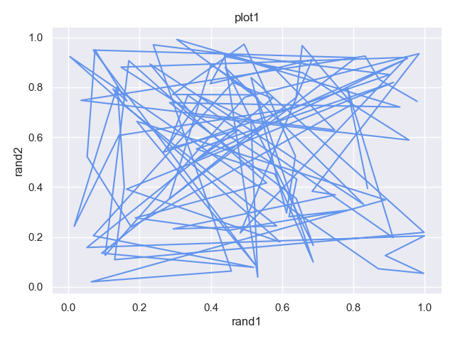
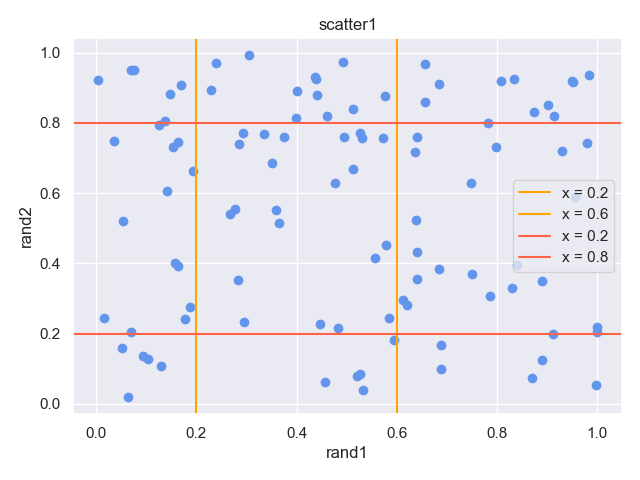
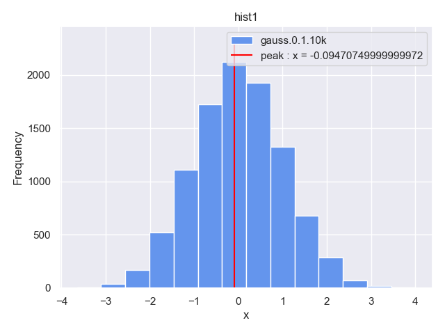
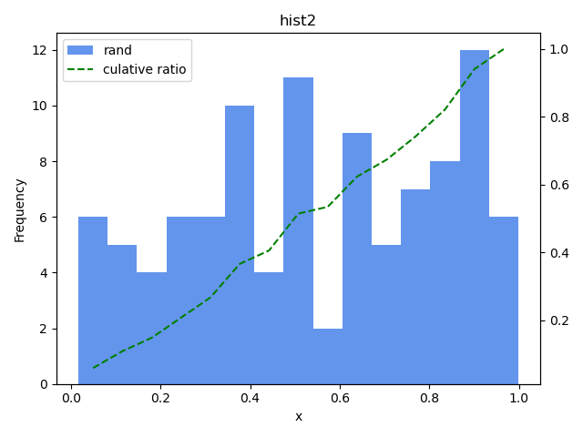
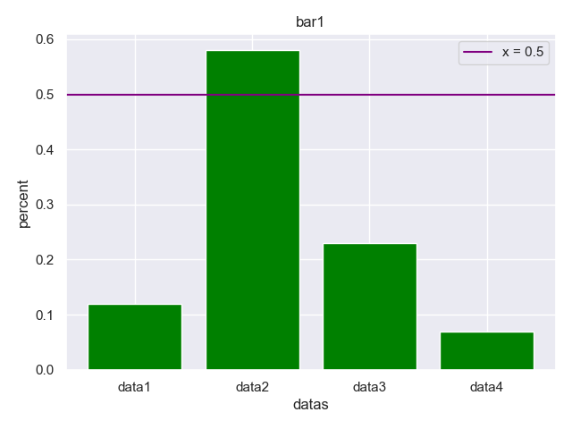
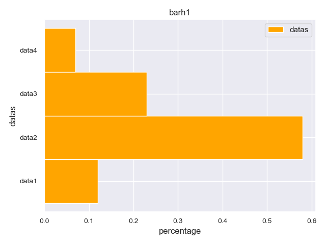
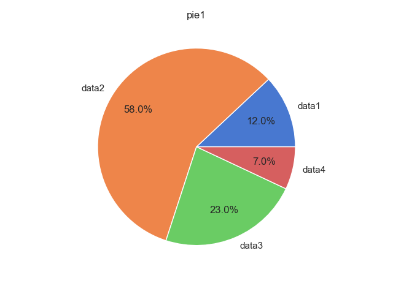
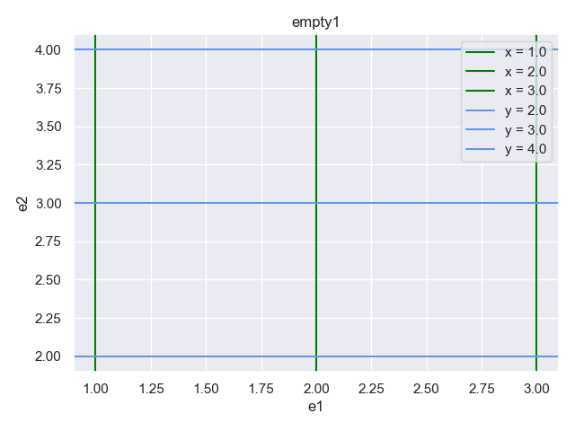

# tmplot.py

One liner Plotter for when you just want to draw a little diagram.

- [tmplot.py](#tmplotpy)
  - [Install tmplot.py](#install-tmplotpy)
    - [dependencies](#dependencies)
  - [Gallery](#gallery)
  - [Quick start](#quick-start)
  - [Mode & Options](#mode--options)
  - [Support function & Usage](#support-function--usage)
  - [Other tmplot](#other-tmplot)

## Install tmplot.py
~~~
git clone https://github.com/th2ch-g/tmplot.py.git && \
cd tmplot.py && \
sed -e "1i#\!$(which python3)" -i tmplot.py
~~~

[CAUTION] Please write shebang in a text editor etc, as using sed on MacOS may cause errors.

### dependencies
- python3 (>=3.9.12 tested)
    - matplotlib
    - seaborn
    - numpy
    - argparse
    - sys

## Gallery
<a href=#plot1>
    </img>
</a>

<a href=#scatter1>
    </img>
</a>

<a href=#hist1>
    </img>
</a>

<a href=#hist2>
    </img>
</a>

<a href=#bar1>
    </img>
</a>

<a href=#barh1>
    </img>
</a>

<a href=#pie1>
    </img>
</a>

<a href=#empty1>
    </img>
</a>

## Quick start

Ex. plot1
~~~sh
for i in {0..100}; do echo ""; done | awk '{print rand(), rand()}' | tmplot.py plot -x - -y - --prefix plot1 --title plot1 --xlabel rand1 --ylabel rand2
~~~

Ex.2 scatter1
~~~sh
for i in {0..100}; do echo ""; done | awk '{print rand(), rand()}' | tmplot.py scatter -x - -y - --prefix scatter1 --title scatter1 --xlabel rand1 --ylabel rand2 --xline "[0.2,0.6]" --yline "[0.2,0.8]"
~~~

Ex. hist1
~~~sh
cat data/grauss.0.1.10k.txt | tmplot.py hist -x - -y - -p hist1 -t t=p --label gauss.0.1.10k --hist-peak-highlight
~~~

Ex. hist2
~~~sh
for i in {0..100}; do echo ""; done | awk '{print rand()}' | tmplot.py hist -x - -y - --hist-cumulative -p hist2 -t t=p --seaborn-off --label rand --hist-bins 15
~~~

Ex. bar1
~~~sh
cat data/tag1.txt | tmplot.py bar -x - -y - --xlabel datas -p bar1 -t bar1 --ylabel percent --yline "[0.5]" --yline-color purple --xtype str --color green
~~~

Ex. barh1
~~~sh
 cat data/tag1.txt  | tmplot.py barh -x - -y - -xt str --barh-height 1 --color orange --label datas -p barh1 -t t=p -xl percentage -yl datas
~~~

Ex. pie1
~~~sh
cat data/tag1.txt | tmplot.py pie -x - -y - -xt str --prefix pie1 -t t=p
~~~

Ex. empty1
~~~sh
tmplot.py empty -x - -y - -xl e1 -yl e2 -p empty1 -t t=p --xline "[1,2,3]" --yline "[2,3,4]" --xline-color green --yline-color cornflowerblue
~~~

## Mode & Options
See help message or [Support function & Usage](#support-function--usage)

## Support function & Usage

|                                                   | Support / Unsupport | Usage example                                                                     |
| ------------------------------------------------- | ------------------- | --------------------------------------------------------------------------------- |
| FILE input                                        | O                   | tmplot.py -x test1.txt -y test2.txt                                               |
| PIPE input                                        | O                   | cat test.txt &#124; tmplot.py plot -x - -y -                                      |
| PNG output                                        | O                   | default output                                                                    |
| JPG output                                        | O                   | --jpg                                                                             |
| PDF output                                        | O                   | --pdf                                                                             |
| ps output                                         | O                   | -ps                                                                               |
| delimiter characters in PIPE input                | O                   | -s / --split  "\t"                                                                |
| Specify input data type in xdata, ydata           | O                   | --xtype int, --xtype float, --xtype str, (ydata is the same way)                  |
| set picture title                                 | O                   | --title title                                                                     |
| set picture xlabel, ylabel                        | O                   | --xlabel xlabel, (ylabel is the same way)                                         |
| set output picture prefix                         | O                   | --prefix prefix                                                                   |
| Plot with connecting the dots                     | O                   | cat test.txt &#124; tmplot.py plot -x - -y -                                      |
| Plot without connecting the dots                  | O                   | cat test.txt &#124; tmplot.py scatter -x - -y -                                   |
| Draw a histogram                                  | O                   | cat test.txt &#124; tmplot.py hist -x - -y -                                      |
| Draw a barplot                                    | O                   | cat test.txt &#124; tmplot.py bar -x - -y -                                       |
| Draw a pie chart                                  | O                   | cat test.txt &#124; tmplot.py pie -x - -y -                                       |
| Draw a bar chart                                  | O                   | cat test.txt &#124; tmplot.py bar -x - -y -                                       |
| Draw a violin plot                                | X                   | Not supported due to differences in data structure                                |
| Draw a box plot                                   | X                   | Not supported due to differences in data structure                                |
| Draw NOTHING                                      | O                   | cat test.txt &#124; tmploy.py empy -x - -y -                                      |
| Draw additional perpendicular line to the axis    | O                   | --xline "[0.3,-0.1,0.5]" (yline is the same way)                                  |
| Change additional perpenddicular line to the axis | O                   | --xline-color black                                                               |
| Log scale on axis                                 | O                   | --xlog or --ylog                                                                  |
| Set grid on / off                                 | O                   | default / --grid-off                                                              |
| Set seaborn theme on / off                        | O                   | default / --seaborn-off                                                           |
| Make the background transparent                   | O                   | --transparent                                                                     |
| Label main mode drawings                          | O                   | -l / --label foo                                                                  |
| Change color of main mode drawings                | O                   | -c / --color green                                                                |
| sort input data                                   | X                   | use: sort command                                                                 |
| normalize input data                              | O                   | --xnorm, --ynorm                                                                  |
| standardize input data                            | O                   | --xstand, --ystand                                                                |
| Drawing range on x-axis, y-axis                   | O                   | --xlim "[1:10]" (ylim is the same way)                                            |
| Cut off input data at maximum and minimum values  | X                   | use: --xlim or --ylim or awk                                                      |
| Perform the same process on all input data.       | X                   | use: awk '{print $1 * 2, $2 + 10}'                                                |
| Specify the number of bins in the histogram       | O                   | --hist-bins 33                                                                    |
| Specify the width of bins in the histogram        | O                   | --hist-bins-width 0.7 (If you use with --hist-bins, --hist-bins takes precedence) |
| Draw a line through the histogram primary peak    | O                   | --hist-peak-highlight                                                             |
| Change a line through the histogram primary peak  | O                   | --hist-peak-highlight-color orange                                                |
| Draw the cumulative ratio of histograms           | O                   | --hist-cumulative                                                                 |
| Change the cumulative ratio of histograms         | O                   | --hist-cumulative-color orange                                                    |
| Change bar width                                  | O                   | --bar-width 0.4                                                                   |
| Change barh height                                | O                   | --barh-height 0.4                                                                 |

## Other tmplot
tmplot (all written in Rust) https://github.com/th2ch-g/tmplot
