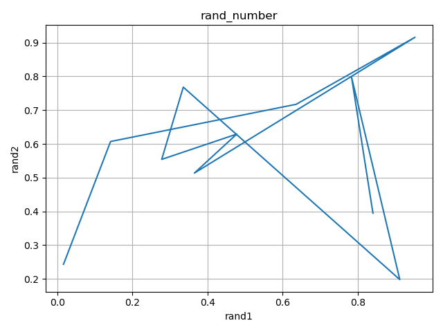
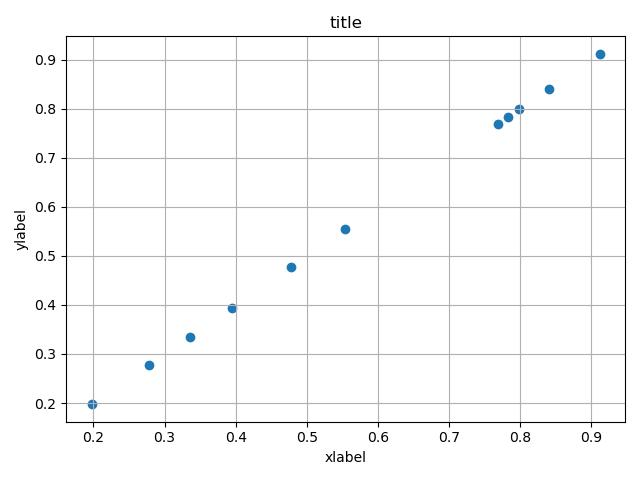

# tmplot.py

Plotter for when you just want to draw a little diagram.

File and PIPE input are supported.

Also supports PNG, JPG output. Default output format is PNG.

## Install tmplot.py
~~~
git clone https://github.com/th2ch-g/tmplot.py.git
~~~

## Usage

### Ex1. PIPE & prefix, xlabel, ylabel, title input
~~~
$ for i in {0..10}; do echo ""; done | awk '{print rand(), rand()}' | \
    tmplot.py plot -x - -y - --prefix random_number --xlabel rand1 --ylabel rand2 --title rand_number
~~~

### Ex2. PIPE & FILE & JPG output
~~~
$ for i in {0..10}; do echo ""; done | awk '{print rand()}' > test.txt && \
    for i in {0..10}; do echo ""; done | awk '{print rand()}' | \
    tmplot.py scatter -x - -y test.txt --jpg && rm -f test.txt
~~~

## Mode & Options
~~~
usage: tmplot.py [-h] -x XDATA -y YDATA [-s SPLIT] [--prefix PREFIX] [--xlabel XLABEL] [--ylabel YLABEL] [--title TITLE] [--jpg] {plot,scatter,hist,bar}

Plotter that supports file and pipe input for quick description

positional arguments:
  {plot,scatter,hist,bar}
                        chose plot mode from {plot, scatter, hist, bar}

optional arguments:
  -h, --help            show this help message and exit
  -x XDATA, --xdata XDATA
                        x_data of 2D-plot. Supports FILE name or PIPE input. For pipe input, use "-x - "
  -y YDATA, --ydata YDATA
                        y_data of 2D-plot. Supports FILE name or PIPE input. For pipe input, use "-y - "
  -s SPLIT, --split SPLIT
                        Target character for data division
  --prefix PREFIX       output picture file prefix
  --xlabel XLABEL       output picture xlabel
  --ylabel YLABEL       output picture ylabel
  --title TITLE         output picture title
  --jpg                 Flag whether JPG output is performed
~~~

## Other tmplot
tmplot (all written in Rust) https://github.com/th2ch-g/tmplot

